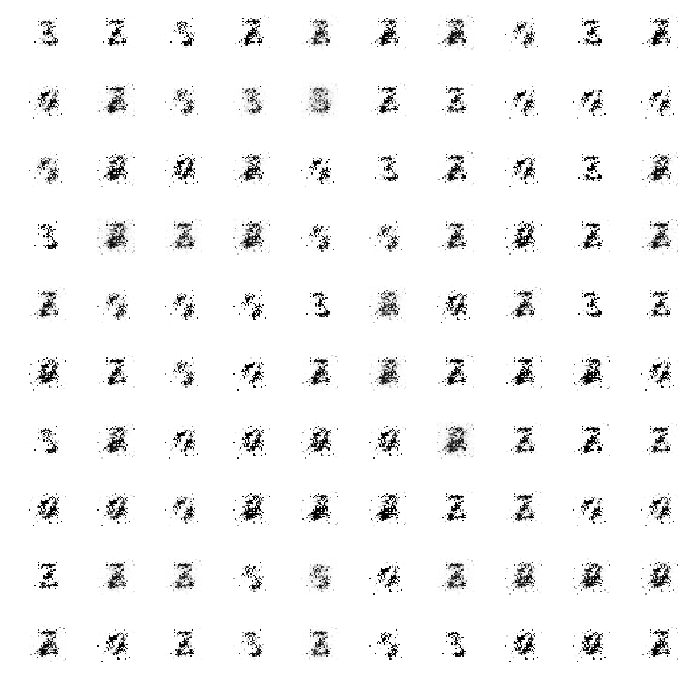

# Differentially Private GAN



MNIST images generated for varying levels of noise.

## Getting Started

If you're using conda, you can replicate the required environment via the following command.

```
conda env create -f environment.yml
```

Otherwise, this repository uses Python 3.6.7. You should be able to install the necessary packages via the following pip command.

```
pip install -r requirements.txt
```

## Structure


