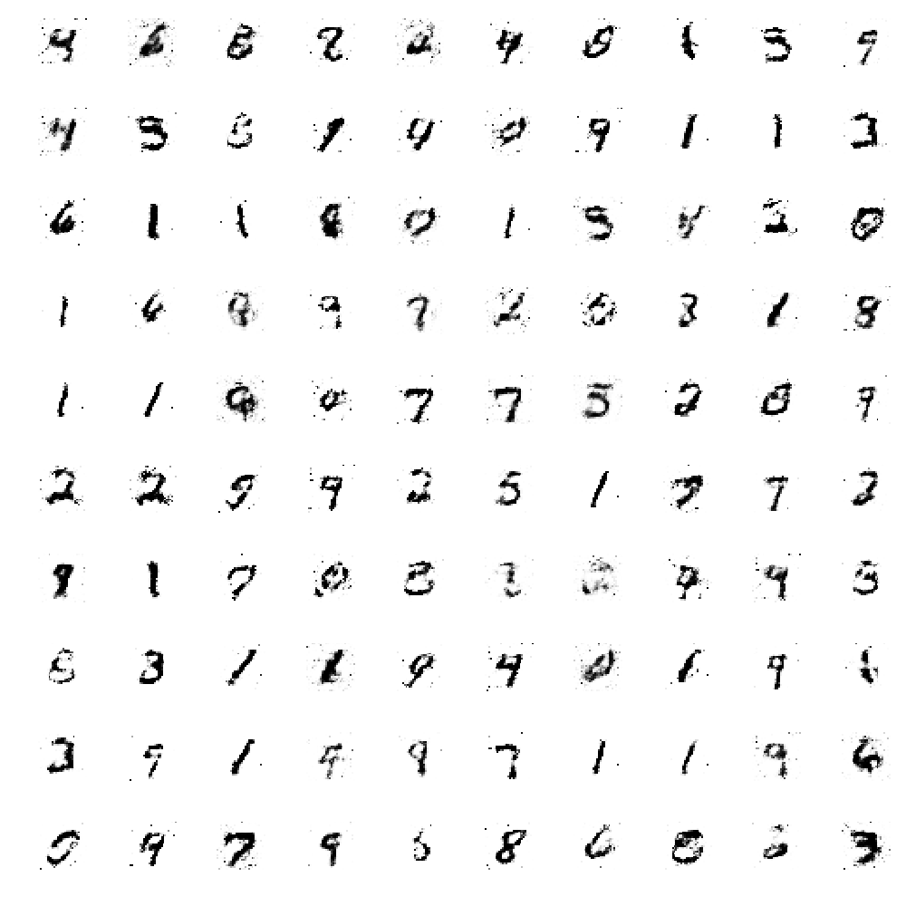

# Differentially Private GAN



## Getting Started

Using conda, you can replicate an appropriate environment via the following command.

```
conda env create -f environment.yml
```

## Structure


